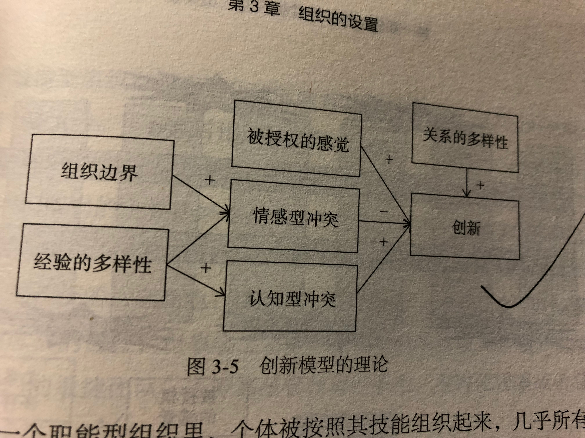

# 架构即未来：现代企业可扩展的Web架构、流程和组织
2018-04-24

## 第一部分  可扩展性组织的人员配置
## 第 1 章  人员和领导力对扩展性的影响
管理是与 “推（pushing）” 相关的活动，而领导是与 “拉（pulling）” 相关的活动。领导设定目的地和通往目的地的路线图，管理设法到达目的地。领导会说：“我们的系统永远都不会因为扩展性而瘫痪”；管理者的工作就是确保这种情况永远不会发生。

__领导活动__  
  - 制定愿景
  - 定义使命
  - 设定目标
  - 营造文化
  - 绩效考核指标选择
  - 激励
  - 制定标准

__管理活动__  
  - 评估目标
  - 绩效考核指标衡量
  - 项目管理
  - 绩效考核
  - 员工指导
  - 员工培训
  - 评估标准

如果一个人聚焦在事务处理方面，那么他就是一个经理；如果一个人更具有远见卓识，那他就是一个领导。

管理把适当的任务分配到人，并且确保这些任务可以在指定的时间内以适当的成本完成。管理对工作表现及时反馈，既反馈对良好表现的赞扬也指出需要改进的地方。管理聚焦在度量和提高。在通往目的地的路上经常有障碍，管理活动也包括移除障碍或者帮助团队绕过障碍。

管理与人相关，需要确保合适的人，在合适的时间，以合适的行为，做合适的工作。

如果管理是推动组织爬坡，那么领导就是选择山头，鼓励员工一起努力翻越山头。领导激励员工和组织做正确的事并好好做事。领导是描绘激动人心的愿景，并把愿景深入到员工的心里，引领他们为公司做正确的事情。领导确定使命、描绘愿景、制定路线图，帮助员工理解做什么和如何做才能为股东创造价值。最后，在向组织最高目标前进的路上，领导定义阶段性的目标和 KPI。

好的领导创造文化，聚焦打造具有高可扩展性的组织、流程和产品而取得成功。

## 第2章　可扩展性技术组织的角色
随着公司的成长和团队规模的扩大，你根本就不可能对所有的事情都去做决策。在很多情况下，事实上，你可能没有资格去做决定。现实告诉我们，你必须找到最好的人，然后才有可能把权力下放给他，并对这些人以最高的标准来严格要求。这也意味着你应该问最合适的问题，比如那些最为关键的项目和系统的决策是怎么做出来的？

执行人员的责任：

__CEO 首席执行官__  
CEO 的工作就是提出合适的问题，让合适的人参与，并且协调外部的支持或建议来寻求正确的答案。

你的部分工作就是寻找真相，只有真相才能使你做出及时和明智的决策。尽管我们不认为团队会说谎，但是对事实经常会有不同的解读，特别是那些涉及可扩展性的问题。当你对一些事情不理解，或者发现事情看起来不太对劲的时候，就要提出质疑。

很多成功的领导都具备 “高管盘问（executive interrogation）” 这个关键能力。比尔·盖茨版本的盘问技能叫 “比尔·盖茨审查”。懂得在什么时候去调查、去哪里调查，直至找出满意的答案，这种技能不仅限于 CEO。

__CFO 首席财务官__  
预算权

__业务部门负责人、总经理、产品线负责人__  
对平台、产品和系统的业务增长做好预测。

__CTO 首席技术官__  
公司的整体技术愿景，设定愿景中积极的、可度量的、可达成的目标。发展可扩展性的企业文化和过程，以确保公司走在用户需求的前面。

__架构师__  
架构师确保系统的设计和架构可以随着业务的发展而扩展。架构师需要在业务需要发生之前就想好，远在业务部门的预测超过平台的容量之前。

架构师也负责制定代码设计和系统实施的技术标准。也可以负责信息技术的管制、标准和过程。

__工程师__  
工程师遵循公司的架构标准，根据架构进行具体设计，并且最后完成代码的实现。工程师团队是最有可能真正了解系统局限性的仅有的几个团队，他们也是发现未来可用性问题的关键人员。

__DevOps__  
DevOps 的人员既知道系统日常运行的情况，也了解系统资源的使用情况。只有他们有足够的资格发现系统的瓶颈，并且在系统设计的时候时刻想着系统配置。

DevOps 负责监控、报告应用与系统的健康情况和服务质量，在解决可用性问题的时候起着关键性的作用。

__基础设施工程师__  
包括 DBA、网络、系统和存储工程师。

不论基础设施人员团队的大小，其主要责任都包括设计共性资源的架构，定义全局的存储架构，确定关系型或非关系型数据库的解决方案。对使用云的公司来说，基础设施团队经常负责管理虚拟服务器、网络和信息安全。

RASCI 工具，一套用来确定责任的表格

  - R：负责 Responsible 对项目或任务的完成负责的人
  - A：批准 Accountable 项目关键决策的批准人
  - S：支持 Supportive 为项目完成提供资源的人
  - C：咨询 Consulted 为项目提供数据或者信息的人
  - I：知情 Informed 需要了解项目相关情况的人

A 不应该批准 R 的方案，直至 R 已经就方案的正确性咨询了所有相关的人。

当然会有这种可能，当员工履行职责时，完成的任务超过了定义好的责任范围。如果能够帮助公司完成使命，那么员工可以，也应该自愿跨越边界去完成工作。重要的是，当这种情况发生时，他们应当和领导一起去找出到底无人负责的地带在哪里，领导应该承诺在未来纠正这些问题。

## 第3章　组织的设置
理解如何度量一个团队的表现，在实际度量中，我们希望看到团队所分担的服务的质量及可用性水平得到提高。我们可以用 “创新” 一词来表示团队有增加值的产出。创新一直被定义成一个包含有效表现的标准。

## 第4章　领导力秘籍
本书把领导力定义为 “影响一个组织或者个人达成某个特定目标的行为的力量”。

领导不仅仅指个人或组织的直接报告人。领导是关于你做什么和如何影响你周围其他人或好或坏的行为。当人们所某人是 “天生的领导” 的时候，他们很可能在讲这个人的魅力、仪表甚至长相。

创新指的是随口说出愿景的能力，而毅力是不断地花时间进行尝试。

专注、希望和同情是改变个人的三个要素。专注是自知，包括感情和能力，希望和同情有助于产生愿景，从而驱动改变。

一些最好的领导人所共同拥有的几个特性

__以身作则，身先士卒__  
己所不欲，勿施于人。好的领导不会滥用职权，他们不认为自己的职位允许他们拥有某种特权。你其实已经得到高收入待遇作为补偿。

__不刚愎自用，谦虚谨慎__  
__努力完成使命，以人为本，使命为先__  
容易让自己的手下跟随自己走向职业发展的新阶段；为所有一流员工建立好向上爬的梯子。

__留意和同情组织的需要__  
__及时决策，决策英明，以德服人__  
__给团队授权，用人不疑__  
__和股东利益保持一致__  

最有成效的领导往往通过理念来影响其组织，把团队的利益置于个人的利益之上，为团队及其成员提供智能激发，为团队成员的福利和职业发展展现出诚实和个性化的关怀。这些特性与另外一种以结果交换价值的交易型或替代型特性形成了鲜明的对比。

一个愿景应该符合下面这些标准：

  - 对理想未来的生动描述
  - 为股东创造价值很重要
  - 可度量
  - 激动人心
  - 结合信仰的因素
  - 大致不变，但可根据需要修改
  - 容易记忆

## 第5章　管理秘籍
需要管理的事情包括人才的不断升级、人员的流动、管理的深度、管理层的实力、团队负责人的选择、新人的招募和技能的辅导。

如果团队要持续提升或改善表现，那么就需要不断地进行下面三项活动：

  - “播种” 就是增加新的、更好的人才
  - “施肥” 就是培养和发展要保留的人
  - “除草” 就是淘汰掉表现不佳的个人

管理是明智和合乎道德地使用手段来完成任务。

## 第6章　关系、思维和商业案例
技术高管理解赚钱的业务手段、收入的驱动力、目前的财务现实、竞争格局和当年的财务目标非常关键。只有具备这种知识和能力的 CTO 才能够制订出合理的技术战略来实现企业的目标。

## 第二部分  构建可扩展的过程
## 第7章　过程是可扩展的关键
真正的挑战是与组织匹配正确的过程、适当的过程数量和正确的时间。可以从少量过程开始，然后慢慢地增加颗粒度，并建立更严格的定义。可能会让团队决定要完成某个特定的任务，合适的过程是什么。

每个过程都应该指定一个人或团队作为所有者。

## 第8章　管理故障和问题
需要一个系统或地方来保存所有的公开问题，并确保这些问题可以和它们触发的事故相关联。我们还需要跟踪这些问题的关闭。

## 第11章　确定应用发展的预留空间
调整项目优先级最好的和唯一的办法是进行 “成本-效益” 分析

## 第14章　敏捷架构设计
公司需要评估整个团队需要建立哪些标准，各团队可以自行建立哪些标准。

## 第15章　聚焦核心竞争力：自建与外购
  - 自建组件能否形成具有战略性差异化的竞争优势？
  - 我们是该资产最好的所有者吗？
  - 该组件的竞争情况如何？
  - 自建的成本效益如何？
