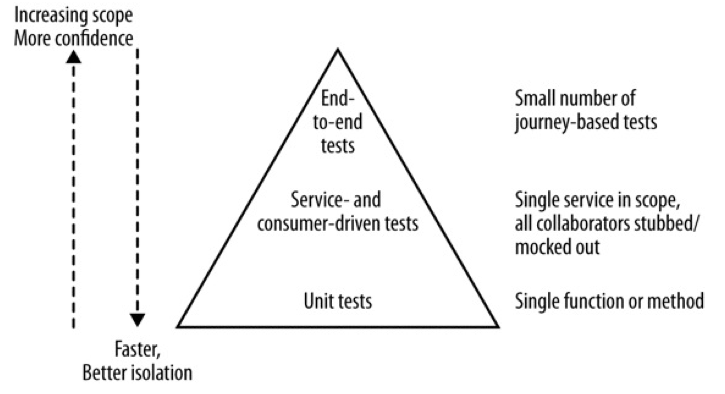

## 1. Microservices
### 脉络
Microservices 定义
Microservices are small, autonomous services
  1. Small, and Focused on Doing One Thing Well
  2. Autonomous

Microservices 的优势
  1. Technology Heterogeneity  [技术多样性，对不同的业务场景选择最合适的技术]
  2. Resilience  [快速可恢复性]
  3. Scaling   [扩展性，不均匀的扩展]
  4. Ease of Deployment  [易部署性，仅仅部署受影响的服务]
  5. Organizational Alignment [人员组织架构的适应性，康威定律]
  6. Composability [可组合性]
  7. Optimizing for Replaceability [替换性]

SOA 和 Microservices 对比
Service-oriented architecture (SOA) is a design approach where multiple services collaborate to provide some end set of capabilities.
[SOA 是一种服务化架构方法论，而 Microservices 是一种具体实践该方法，类似 Unicode 和 UTF-8 的关系]

其他解耦合技术
1. Shared Libraries
   drawbacks [共享库的缺点]
     - lose true technology heterogeneity.
     - scale parts of system independently from each other is curtailed.
     - ability to deploy changes in isolation is reduced.
   Creating code for common tasks that aren’t specific to your business domain that you want to reuse across the organization
    [适合共享库的地方是业务领域无关的公共任务]

2. Modules
   They allow some lifecycle management of the modules, such that they can be deployed into a running process, allowing you to make changes without taking the whole process down, Like java OSGI, Erlang.
   [目前的动态模块化技术在实践中并未大规模采用，不够成熟。]

### 亮点
This is reinforced by Robert C. Martin’s definition of the Single Responsibility Principle, which states “Gather together those things that change for the same reason, and separate those things that change for different reasons.”

So you should instead think of microservices as a specific approach for SOA in the same way that XP or Scrum are specific approaches for Agile software development.

Having a process boundary separation does enforce clean hygiene in this respect (or at least makes it harder to do the wrong thing!).

--------------------------------------------------------------------------------

## 2. The Evolutionary Architect
### 脉络
Inaccurate Comparisons
[比较建筑和软件，Architect 这个词来源于建筑学，但软件产品和建筑物的性质完全不同]

An Evolutionary Vision for the Architect
[软件系统会在其生命周期中不断变化，唯一不变的就是变化，拥抱变化，用进化的观点看待架构演进]

Zoning
[软件架构师更像是城市规划师而非建筑师，对软件进行类似城市划分区域的规划，一个垃圾处理厂不应该进入生活区]

A Principled Approach
Strategic Goals & Architectual Principle & Design and Code Practice
[架构如何服务于战略目标，架构原则和设计编码实践，原则来源于实践变化较少，而实践方式在工作中不断优化改变]

The Required Standard
[定义服务标准，接口定义规范化，监控统一，保障架构的安全性，避免雪崩效应]

Governance Through Code
[Dropwizard](www.dropwizard.io) and [Karyon](github.com/Netflix/karyon) are two open source, JVM-based microcontainers
a circuit breaker library like [Hystrix](github.com/Netflix/Hystrix)
[定义服务模板，作好代码规范管理]

Governance and Leading from the Center
Architects are responsible for a lot of things. They need to ensure there is a set of principles that can guide development, and that these principles match the organization’s strategy. They need to make sure as well that these principles don’t require working practices that make developers miserable. They need to keep up to date with new technology, and know when to make the right trade-offs. This is an awful lot of responsibility. All that, and they also need to carry people with them — that is, to ensure that the colleagues they are working with understand the decisions being made and are brought in to carry them out. Oh, and as we’ve already mentioned: they need to spend some time with the teams to understand the impact of their decisions, and perhaps even code too.

Think about teaching children to ride a bike. You can’t ride it for them. You watch them wobble, but if you stepped in every time it looked like they might fall off, then they’d never learn, and in any case they fall off far less than you think they will! But if you see them about to veer into traffic, or into a nearby duck pond, then you have to step in.
[微服务化架构下架构师的职责，如何从中心掌控全局？以服务划分责任，让团队和服务分组绑定，自治管理，作好监护。]

Building a Team
[微服务架构让服务帮助开发人员（服务拥有者）增强责任感，我的地盘我做主，有利于个人职业生涯发展。]

### 亮点
To borrow a term from Frank Buschmann, architects have a duty to ensure that the system is habitable for developers too.

So our architects as town planners need to set direction in broad strokes, and only get involved in being highly specific about implementation detail in limited cases.

That means we need to spend time thinking about how our services talk to each other, or ensuring that we can properly monitor the overall health of our system.

If you’re the person defining the company’s technical vision, this may mean you’ll need to spend more time with the nontechnical parts of your organization

Rules are for the obedience of fools and the guidance of wise men.  -- Generally attributed to Douglas Bader
Making decisions in system design is all about trade-offs, and microservice architectures give us lots of trade-offs to make!

With larger, monolithic systems, there are fewer opportunities for people to step up and own something. With microservices, on the other hand, we have multiple autonomous codebases that will have their own independent lifecycles. Helping people step up by having them take ownership of individual services before accepting more responsibility can be a great way to help them achieve their own career goals, and at the same time lightens the load on whoever is in charge!

--------------------------------------------------------------------------------

## 3. How to Model Services
### 脉络
What Makes a Good Service?
  - Loose Coupling
  - High Cohesion

The Bounded Context & Business Capabilities
[服务边界与服务能力的定义]

### 亮点
I called this onion architecture, as it had lots of layers and made me cry when we had to cut through it.
[洋葱架构模式，一层又一层的强耦合，重构像像切洋葱一样让人想哭]

--------------------------------------------------------------------------------

## 4. Integration
### 脉络
Looking for the Ideal Integration Technology
  - Avoid Breaking Changes
  - Keep Your APIs Technology-Agnostic
  - Make Your Service Simple for Consumers
  - Hide Internal Implementation Detail

Orchestration Versus Choreography
[中心化（乐队指挥）和去中心化（舞蹈者自组织）的选择？？]

Remote Procedure Calls
  - Technology Coupling [技术耦合，绑定到特定平台]
  - Local Calls Are Not Like Remote Calls [隐藏了网络传输，滥用导致性能问题]
  - Brittleness [接口变更导致 consumer 同步变更]

REST
[性能和易用性不如 RPC，更适合作为和外部异构系统的服务接口]

Implementing Asynchronous Event-Based Collaboration
MQ, HTTP ATOM [关注异步带来的复杂性]

Reactive Extensions
As you find yourself making more service calls, especailly when making multiple calls to perform a single operation, take a look at the reactive extensions for your chosen technology stack. such as RxJava.

DRY and the Perils of Code Reuse in a Microservice World
My general rule of thumb: don’t violate DRY within a microservice, but be relaxed about violating DRY across all services.

Versioning
Postel’s Law (otherwise known as the robustness principle), which states: “Be conservative in what you do, be liberal in what you accept from others.”  
[发送保守，接收开放]

### 亮点
With orchestration, we rely on a central brain to guide and drive the process, much like the conductor in an orchestra. With choreography, we inform each part of the system of its job, and let it work out the details, like dancers all finding their way and reacting to others around them in a ballet.
[选择乐队模式（有一个中心指挥），还是舞蹈方式（事件响应模式）乐队模式存在中心的 God Service，容易形成强耦合，但更有利于监控整个业务流程舞蹈模式，服务更自治，更松耦合，但无法直观反应业务流。]

keep your middleware dumb, and keep the smarts in the endpoints.
[中间件不需要那么智能，这样只会让系统的交互行为变得不可预测，智能逻辑放在服务端]

--------------------------------------------------------------------------------

## 6. Deployment
### 脉络
Build Pipelines and Continuous Delivery
[构建流水化]

Service Configuration
[中心配置服务]

Single Service Per Host
[最适合微服务架构的部署方案，实现物理资源隔离，需要虚拟化(Hypervisor)、容器化(LXC, Docker) 等技术支持]

Automation
[没有自动化工具链的支持千万不要采用微服务架构]

From Physical to Virtual
[Docker Kubernetes CoreOS Deis]
In many ways, Docker with an appropriate scheduling layer sits between IaaS and PaaS solutions — the term containers as a service (CaaS) is already being used to describe it.

--------------------------------------------------------------------------------

## 7. Testing
### 脉络
Types of Tests

Test Scope

Testing After Production
  - Smoking test [精心挑选的冒烟测试集来验证发布环境问题确保发布成功]
  - blue/green deployment
  - Canary Releasing

### 亮点
The best way to counter this is to focus on a small number of core journeys to test for the whole system.
